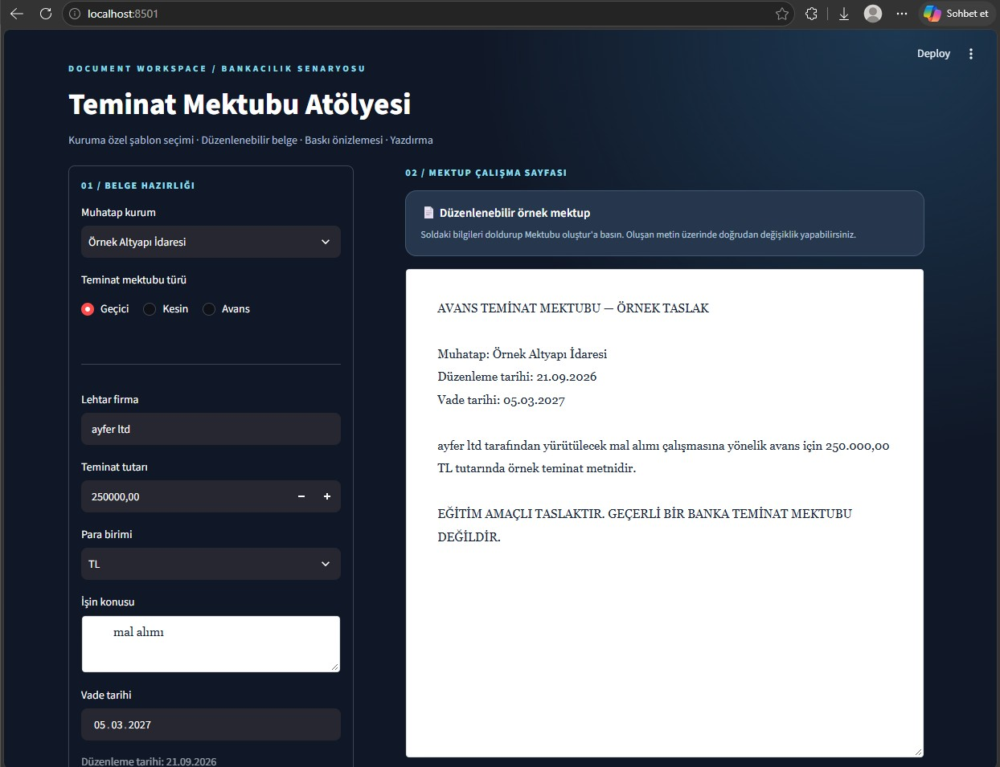

Teminat Mektubu Atölyesi
Python ve Streamlit kullanılarak geliştirilmiş, teminat mektubu oluşturma sürecini örnekleyen eğitim ve portföy projesidir.

🎯 Projenin Amacı
Bu proje, her kurumun sürekli talep ettiği tm türlerinin sisteme entegre edilerek her seferinde yeni baştan yazmadan kullanıcıdan alınan bilgilerle dinamik olarak bir taslak oluşturulmasını amaçlamaktadır.

Kullanıcı;
Kurum
Teminat mektubu türü
Lehtar
Tutar ve para birimi
İşin konusu
Vade tarihi
bilgilerini girerek örnek bir teminat mektubu taslağı oluşturabilir.

⚙️ Nasıl Çalışır?
Uygulamada kurum ve mektup türüne göre uygun şablon Python sözlük yapısından seçilir.
Kullanıcının girdiği bilgiler ilgili alanlara yerleştirilerek mektup metni dinamik olarak oluşturulur.
Oluşturulan metin uygulama içerisinde düzenlenebilir ve indirilerek tarayıcı üzerinden yazdırılabilir veya PDF olarak kaydedilebilir.

🛠 Kullanılan Teknolojiler
Python
Streamlit

📁 Proje Dosyaları

main.py
Streamlit kullanıcı arayüzünü ve uygulamanın temel akışını içerir.

mektup_motoru.py
Örnek mektup şablonlarını ve seçilen bilgilere göre metin oluşturma fonksiyonunu içerir.

▶️ Uygulamayı Çalıştırma
Öncelikle Streamlit kurulmalıdır: pip install streamlit

Ardından proje klasöründe: python -m streamlit run main.py  komutu çalıştırılır.

## 📸 Uygulama Görünümü

